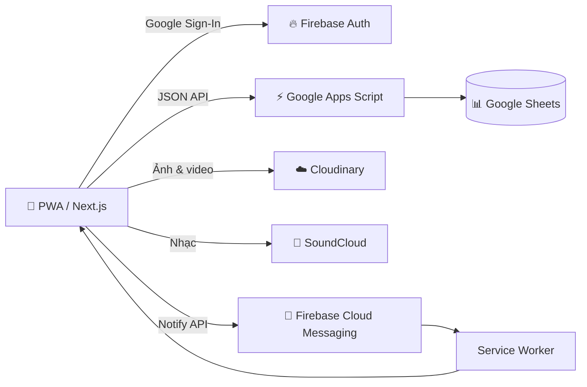

# 💗 Love Days

> Không gian riêng tư dành cho hai người — lưu lại từng ngày yêu, từng bức ảnh và những điều chỉ hai người biết.

<p align="center"></p>

<p align="center">
  
  
  
  
  
  
  
</p>

<p align="center">
  <a href="#-tính-năng">Tính năng</a> •
  <a href="#-kiến-trúc">Kiến trúc</a> •
  <a href="#-api-reference">API</a> •
  <a href="#-cài-đặt">Cài đặt</a> •
  <a href="#-tác-giả">Tác giả</a> •
  <a href="#-bản-quyền">Bản quyền</a>
</p>

---

## Giới thiệu

Love Days là web app mobile-first dành riêng cho các cặp đôi. Hai tài khoản Google có thể ghép đôi qua liên kết hoặc UID, sau đó cùng lưu ảnh, trò chuyện, nghe nhạc và xây dựng một không gian kỷ niệm riêng tư.

Ứng dụng có thể cài lên màn hình chính dưới dạng PWA trên iPhone và Android.

## ✨ Tính năng

### Kết nối và riêng tư

- Đăng nhập bằng Google qua Firebase Authentication.
- Ghép đôi bằng liên kết hoặc UID và yêu cầu người nhận đồng ý.
- Dữ liệu của cặp đôi chỉ hiển thị cho hai thành viên đã ghép đôi.
- Hồ sơ cá nhân, ảnh đại diện và thông tin người thương.
- Khóa bằng PIN hoặc Face ID/vân tay trên thiết bị hỗ trợ WebAuthn.

### Kỷ niệm

- Bộ đếm ngày yêu và ảnh chung trên trang chủ.
- Timeline ảnh, chỉnh sửa, xóa, tag và lọc theo thời gian.
- Locket camera: chụp hoặc tải nhiều ảnh, reaction, trả lời và chat realtime.
- Album ảnh/video theo chuyến đi và bộ sưu tập những “lần đầu”.
- Nhật ký chung, lịch đôi, lời nhắc và Time Capsule.
- Tìm kiếm theo nội dung, ngày, người đăng và hashtag.

### Cùng nhau

- Tìm kiếm, phát và tải nhạc từ SoundCloud.
- Playlist yêu thích và lịch sử nghe nhạc chung.
- Danh sách mong muốn và thử thách đôi với check-in hằng ngày.
- Xuất dữ liệu thành JSON/PDF và sao lưu tự động trên thiết bị.

### PWA và thông báo

- Giao diện mobile-first, tối ưu safe-area và bàn phím điện thoại.
- Cài đặt lên màn hình chính và hoạt động với Service Worker.
- Firebase Cloud Messaging thông báo ảnh, tin nhắn và sự kiện mới.
- Chạm thông báo để mở đúng nội dung liên quan.

## 🧰 Công nghệ sử dụng

| Thành phần | Công nghệ |
|---|---|
| Giao diện | Next.js 14, React 18, TypeScript, Tailwind CSS, Framer Motion |
| Xác thực | Firebase Authentication — Google Sign-In |
| Dữ liệu | Google Sheets + Google Apps Script Web App |
| Ảnh và video | Cloudinary |
| Thông báo | Firebase Cloud Messaging + Service Worker |
| Âm nhạc | SoundCloud API + Next.js API Routes |
| Triển khai | Render hoặc nền tảng hỗ trợ Next.js Node server |

## 🏗 Kiến trúc



| Lớp | Trách nhiệm |
|---|---|
| Client PWA | Giao diện, cache, camera, upload, trình phát và thông báo |
| Next.js server | Proxy nhạc, tải MP3, xác thực request và gửi FCM |
| Apps Script | API dữ liệu, xác thực Firebase token và phân quyền cặp đôi |
| Google Sheets | Lưu document theo đường dẫn trong sheet `Records` |
| Cloudinary | Lưu file ảnh/video; Sheets chỉ giữ URL và metadata |

## 🔌 API Reference

### Next.js API Routes

| Method | Endpoint | Tham số chính | Chức năng |
|---|---|---|---|
| `GET` | `/api/health` | — | Health check và đánh thức server Render |
| `GET` | `/api/music` | `source=soundcloud`, `q` | Tìm bài hát hoặc lấy danh sách đề xuất |
| `GET` | `/api/music/stream` | `source`, `url` | Resolve và stream audio tới trình phát |
| `GET` | `/api/music/download` | `source`, `url`, `title` | Tải bài hát về máy với tên file an toàn |
| `POST` | `/api/notify/photo` | `itemId`, `senderUid` | Thông báo ảnh chung mới |
| `POST` | `/api/notify/locket` | `itemId`, `senderUid` | Thông báo bài Locket mới |
| `POST` | `/api/notify/chat` | `itemId`, `senderUid` | Thông báo tin nhắn mới |
| `POST` | `/api/notify/memory` | `itemId`, `senderUid` | Thông báo kỷ niệm mới |
| `POST` | `/api/notify/phase-one` | `kind`, `itemId`, `senderUid` | Thông báo nhật ký, lịch đôi hoặc Time Capsule |
| `POST` | `/api/notify/timecapsule-check` | Header chứa `CRON_SECRET` | Cron kiểm tra lịch nhắc và hộp thư đến ngày mở |

Các notify route yêu cầu Firebase ID token hợp lệ. Server kiểm tra UID, quan hệ ghép đôi và document trước khi gửi FCM; không nên gọi trực tiếp từ client không đăng nhập.

### Google Apps Script Web App

Tất cả thao tác dùng `POST` tới URL `NEXT_PUBLIC_APPS_SCRIPT_URL`. Client gửi `{ action, token, ...payload }`; server nội bộ gửi `{ action, secret, ...payload }`.

| Action | Payload | Kết quả |
|---|---|---|
| `get` | `path` | Đọc một document |
| `list` | `path`, `constraints[]` | Đọc collection, lọc, sắp xếp và giới hạn |
| `write` | `operation` | Tạo, cập nhật hoặc xóa một document |
| `batch` | `operations[]` | Ghi tối đa 25 thao tác trong một lần gọi |
| `exportCouple` | `coupleId` | Xuất toàn bộ dữ liệu được phép của cặp đôi |
| `collectionGroup` | `name` | Server đọc collection group phục vụ cron/notification |

Phản hồi chuẩn:

```json
{
  "ok": true,
  "version": "love-days-sheets-v2",
  "data": {}
}
```

> `collectionGroup` chỉ dành cho server có `SERVER_SECRET`. Các action client được kiểm tra thành viên cặp đôi trước khi đọc hoặc ghi.

### Collections dữ liệu

| Đường dẫn | Nội dung |
|---|---|
| `users/{uid}` | Hồ sơ, `coupleId` và FCM tokens |
| `pairInvites/{inviteId}` | Lời mời ghép đôi qua UID hoặc liên kết |
| `couples/{coupleId}` | Hai thành viên, ngày bắt đầu và trạng thái ghép đôi |
| `couples/{coupleId}/photos` | Ảnh chung trên trang chủ |
| `couples/{coupleId}/memories` | Timeline kỷ niệm |
| `couples/{coupleId}/mediaMemories` | Kho ảnh/video kỷ niệm |
| `couples/{coupleId}/locketPosts` | Bài ảnh Locket và reaction |
| `couples/{coupleId}/locketPosts/{postId}/replies` | Phản hồi theo từng bài Locket |
| `couples/{coupleId}/locketMessages` | Tin nhắn riêng realtime |
| `couples/{coupleId}/journalEntries` | Nhật ký chung hằng ngày |
| `couples/{coupleId}/coupleEvents` | Lịch đôi và ngày nhắc |
| `couples/{coupleId}/timeCapsules` | Thư và media khóa đến ngày mở |
| `couples/{coupleId}/tripAlbums` | Album chuyến đi |
| `couples/{coupleId}/firstMoments` | Bộ sưu tập những lần đầu |
| `couples/{coupleId}/musicFavorites` | Playlist yêu thích chung |
| `couples/{coupleId}/musicHistory` | Nhật ký nghe nhạc |
| `couples/{coupleId}/wishItems` | Danh sách mong muốn |
| `couples/{coupleId}/coupleChallenges` | Thử thách và lịch sử check-in |

Google Sheets lưu các document dưới dạng `path + JSON` trong sheet `Records`. Đây là cấu trúc logic của API, không phải các tab Sheet riêng biệt.

## 🚀 Cài đặt

Yêu cầu Node.js 20 trở lên và npm.

```bash
git clone https://github.com/Kzi207/l-p.git
cd l-p
npm install
copy .env.local.example .env.local
npm run dev
```

Mở `http://localhost:3000`. Service Worker được tắt trong development; hãy dùng production build hoặc HTTPS để kiểm tra PWA và push notification.

## 🔐 Biến môi trường

Tạo `.env.local` và điền các biến sau. Không commit file này lên GitHub.

```env
# Firebase Web SDK
NEXT_PUBLIC_FIREBASE_API_KEY=
NEXT_PUBLIC_FIREBASE_AUTH_DOMAIN=
NEXT_PUBLIC_FIREBASE_PROJECT_ID=
NEXT_PUBLIC_FIREBASE_STORAGE_BUCKET=
NEXT_PUBLIC_FIREBASE_MESSAGING_SENDER_ID=
NEXT_PUBLIC_FIREBASE_APP_ID=
NEXT_PUBLIC_FIREBASE_VAPID_KEY=

# Google Apps Script database
NEXT_PUBLIC_APPS_SCRIPT_URL=https://script.google.com/macros/s/DEPLOYMENT_ID/exec
SERVER_SECRET=

# Cloudinary unsigned upload
NEXT_PUBLIC_CLOUDINARY_CLOUD_NAME=
NEXT_PUBLIC_CLOUDINARY_UPLOAD_PRESET=

# Server
FIREBASE_ADMIN_SA_BASE64=
APP_URL=https://your-domain.example
CRON_SECRET=
```

Các biến `NEXT_PUBLIC_*` được gửi tới trình duyệt và không phải server secret. Tuyệt đối không đưa Service Account JSON, private key, `SERVER_SECRET` hoặc `CRON_SECRET` vào mã nguồn.

## ⚡ Thiết lập Google Apps Script

1. Tạo một Google Sheet mới.
2. Mở **Extensions → Apps Script**.
3. Sao chép [`google-apps-script/Code.gs`](google-apps-script/Code.gs) và [`google-apps-script/appsscript.json`](google-apps-script/appsscript.json).
4. Trong **Project Settings → Script Properties**, tạo:

```text
SPREADSHEET_ID=<ID của Google Sheet>
FIREBASE_API_KEY=<Firebase Web API Key>
SERVER_SECRET=<chuỗi bí mật dài và ngẫu nhiên>
```

5. Chọn **Deploy → New deployment → Web app**.
6. Đặt **Execute as: Me** và **Who has access: Anyone**.
7. Sao chép URL kết thúc bằng `/exec` vào `NEXT_PUBLIC_APPS_SCRIPT_URL`.

Sau mỗi lần sửa `Code.gs`, chọn **Deploy → Manage deployments → Edit → New version → Deploy**. URL `/exec` được giữ nguyên.

## ☁️ Thiết lập Cloudinary

1. Tạo unsigned upload preset trong Cloudinary Console.
2. Cho phép `jpg`, `jpeg`, `png`, `webp`, `heic`, `mp4`, `mov` và `webm`.
3. Điền Cloud name và preset vào biến môi trường.
4. Không đưa Cloudinary API Secret vào frontend.

Ảnh được nén trên thiết bị trước khi upload để giảm dữ liệu truyền và tải máy chủ.

## ✅ Kiểm tra chất lượng

```bash
npm run typecheck
npm run lint
npm run build
```

## 🌍 Triển khai

Trên Render hoặc nền tảng Node.js tương thích:

```text
Build Command: npm install && npm run build
Start Command: npm run start
```

Sau khi triển khai:

1. Thêm domain vào **Firebase Authentication → Authorized domains**.
2. Cập nhật `APP_URL` bằng domain chính thức.
3. Truy cập `/api/health` và kiểm tra `{ "status": "ok" }`.
4. iOS: Safari → Chia sẻ → **Thêm vào Màn hình chính**.
5. Android: Chrome → **Cài đặt ứng dụng**.

## 📁 Cấu trúc dự án

```text
src/
├── app/                    # Pages và Next.js API Routes
├── components/             # Giao diện, providers và tính năng
├── lib/                    # Firebase, Apps Script, Cloudinary, thông báo
└── types/                  # Kiểu dữ liệu dùng chung

google-apps-script/         # Database API chạy trên Google Apps Script
public/                     # PWA manifest, icons và assets
scripts/                    # Công cụ migration dữ liệu
worker/                     # Custom Service Worker
```

## 👨‍💻 Tác giả

<table>
  <tr>
    <td align="center" width="150"><br /><strong>Khánh Duy</strong></td>
    <td>
      Tác giả, thiết kế và phát triển Love Days.<br /><br />
      🌐 <a href="https://khanhduy.id.vn">khanhduy.id.vn</a><br />
      🐙 <a href="https://github.com/Kzi207">github.com/Kzi207</a>
    </td>
  </tr>
</table>

## ⚖️ Bản quyền

Copyright © 2026 **Khánh Duy**. All rights reserved.


Dự án này là phần mềm có bản quyền và **không phải phần mềm mã nguồn mở**. Bạn chỉ được phép xem, tham khảo, chỉnh sửa và sử dụng cho mục đích cá nhân, học tập hoặc phi thương mại.

Bạn **không được phép** nếu chưa có sự đồng ý trước bằng văn bản của tác giả:

- Sử dụng dự án hoặc bất kỳ phần nào cho mục đích thương mại.
- Bán, cho thuê, cấp phép lại, kiếm tiền hoặc thu phí truy cập.
- Dùng mã nguồn để cung cấp sản phẩm, dịch vụ hay website có doanh thu.
- Sao chép, phát hành lại hoặc nhận là sản phẩm do mình tạo ra.
- Xóa hoặc thay đổi thông tin tác giả và thông báo bản quyền.

Fork repository để học tập và đóng góp phi thương mại được phép nếu giữ nguyên thông tin tác giả và bản quyền. Mọi quyền không được cấp rõ ràng đều thuộc về **Khánh Duy**.

Muốn sử dụng thương mại, bạn phải có giấy phép riêng bằng văn bản từ tác giả.

Xem đầy đủ tại [`LICENSE`](LICENSE).

---

<p align="center">Được tạo bằng tình yêu, dành cho những điều đáng nhớ. 💞</p>
